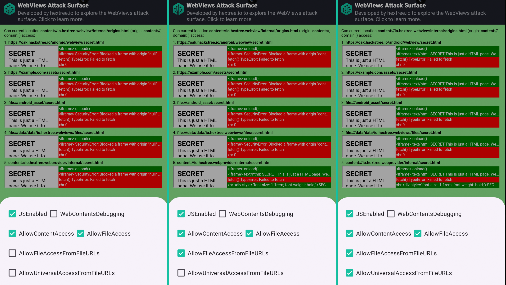
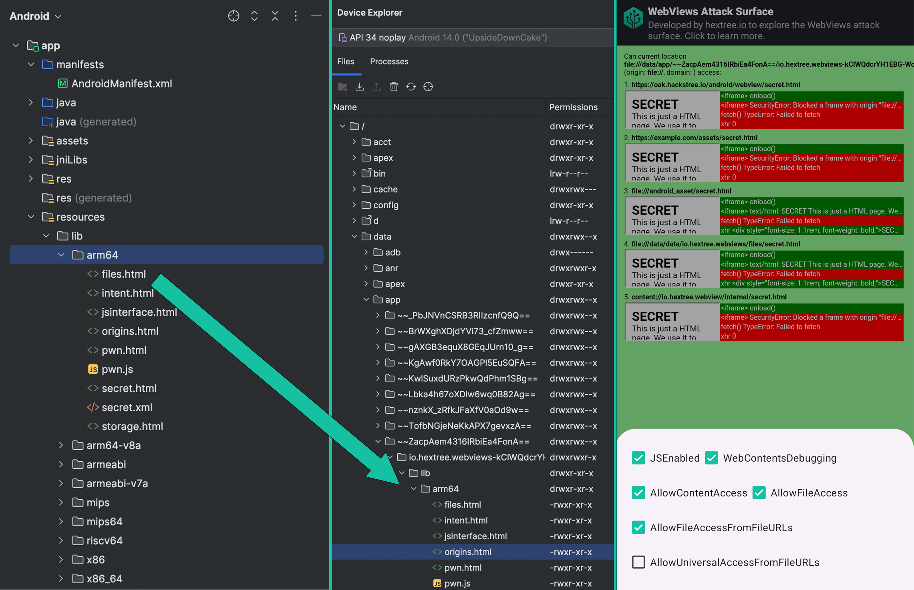

# WebView Research

This app performs various tests to explore the attack surface and exploit strategies related to Android [WebView](https://developer.android.com/develop/ui/views/layout/webapps/webview) and [CustomTabs](https://developer.chrome.com/docs/android/custom-tabs/guide-get-started). It was developed as part of the [Hextree Android app security courses](https://app.hextree.io/map/android/android-webview) ([sponsored by Google](https://www.hextree.io/hextree-x-google)).


**Signed Builds:**
- Debug Build: [io.hextree.webview_debug.apk](app/debug/io.hextree.webview_debug.apk)
- Release Build: [io.hextree.webview.apk](app/release/io.hextree.webview.apk)

**Table of contents:**

- [1. Test Cases](#1-test-cases)
- [2. Features](#2-features)
- [3. Results](#3-test-results)
    - [3.1 content:// Same Origin Policy weakness](#31-content-same-origin-policy-weakness)
    - [3.2 file:// extractNativeLibs Trick](#32-file-extractnativelibs-trick)
    - [3.3 Malicious CustomTabs Browser]()

## 1. Test Cases
The app can load different test cases in the WebView. Each test consists of a single `.html` file with JavaScript to test access on various origins.

- [Same Origin Policy Test](app/src/main/assets/origins.html)
- [Internal File Leak Tests](app/src/main/assets/files.html)
- [DOM Storage Tests](app/src/main/assets/storage.html)
- [JavaScript Interface Tests](app/src/main/assets/pwn.html)

Additionally, the app also explores features of [CustomTabs](https://developer.chrome.com/docs/android/custom-tabs/guide-get-started):

- CustomTab without session
- CustomTab with session
- CustomTab with verified origin (oak.hackstree.io)

## 2. Features

Depending on the [WebView settings](https://developer.android.com/reference/android/webkit/WebSettings) and the origin of the loaded `.html` file, the test case results vary. Settings can be changed on the fly to observe their impact:

- [`setJavaScriptEnabled(boolean)`](https://developer.android.com/reference/android/webkit/WebSettings#setJavaScriptEnabled(boolean))
- [`setAllowContentAccess(boolean)`](https://developer.android.com/reference/android/webkit/WebSettings#setAllowContentAccess(boolean))
- [`setAllowFileAccess(boolean)`](https://developer.android.com/reference/android/webkit/WebSettings#setAllowFileAccess(boolean))
- [`setAllowFileAccessFromFileURLs(boolean)`](https://developer.android.com/reference/android/webkit/WebSettings#setAllowFileAccessFromFileURLs(boolean))
- [`setAllowUniversalAccessFromFileURLs(boolean)`](https://developer.android.com/reference/android/webkit/WebSettings#setAllowUniversalAccessFromFileURLs(boolean))

The test cases can also be loaded from [various sources](https://github.com/hextreeio/android-webview-research/blob/main/app/src/main/java/io/hextree/webviews/activities/WebViewsTestActivity.java#L159) (origins):

- Website (`https://oak.hextree.io/android/webview/...`)
- APK assets (`file:///android_asset/...`)
- data URI (`data:text/html;base64,PGgxPmhleHRyZWUuaW88L2gxPgpMZW...`)
- FileProvider (`content://io.hextree.webprovider/internal/...`)
- Absolute path (`file:///data/data/io.hextree.webviews/files/...`)
- Native libs trick (`file:///data/app/~~pUnr.../lib/arm64/...`)

## 3. Test Results

Below are some notable results from the tests conducted with this app. Understanding these results is important for developers and bug hunters looking into WebView security.

### 3.1 content:// Same Origin Policy weakness

[By default](https://developer.android.com/reference/android/webkit/WebSettings#setAllowContentAccess(boolean)), WebViews can load resources from `content://` URIs. This allows an app to expose a malicious `.html` file through a [FileProvider](https://developer.android.com/reference/androidx/core/content/FileProvider) and `Intent.FLAG_GRANT_READ_URI_PERMISSION`.


1. If [`setAllowFileAccessFromFileURLs(true)`](https://developer.android.com/reference/android/webkit/WebSettings#setAllowFileAccessFromFileURLs(boolean)) is enabled, JavaScript can leak data from other accessible FileProviders. Depending on the configured file paths (see example below), internal app files could be exposed.
```xml
// Example AndroidManifest.xml
<provider
    android:name="androidx.core.content.FileProvider"
    android:authorities="io.hextree.webview"
    android:exported="false" android:grantUriPermissions="true">
    <meta-data
        android:name="android.support.FILE_PROVIDER_PATHS"
        android:resource="@xml/filepaths" />
</provider>

// FileProvider config: xml/filepaths.xml
<paths>
    <files-path name="internal" path="." />
</paths>
```
2. If [`setAllowUniversalAccessFromFileURLs(true)`](https://developer.android.com/reference/android/webkit/WebSettings#setAllowUniversalAccessFromFileURLs(boolean)) is enabled, the `content://` origin is partially treated as a file URL. While XHR requests are blocked, file leaks through `<iframe>` are possible.

FYI: We have also reported this behavior in case this is a security bug: https://issuetracker.google.com/issues/387101937



### 3.2 file:// extractNativeLibs Trick

With [scoped storage](https://developer.android.com/training/data-storage#scoped-storage) introduced in Android 11, it is nearly impossible to create a `file://` URL readable by other apps:

> *"On Android 11, apps can no longer access files in any other app's dedicated, app-specific directory within external storage."* - [Storage updates in Android 11](https://developer.android.com/about/versions/11/privacy/storage#other-app-specific-dirs)

This makes it difficult to attack WebViews by loading a malicious page from the `file://` origin without additional permissions like [`MANAGE_EXTERNAL_STORAGE`](https://developer.android.com/reference/android/Manifest.permission#MANAGE_EXTERNAL_STORAGE). However, we discovered a trick that leverages the [`extractNativeLibs`](https://developer.android.com/guide/topics/manifest/application-element#extractNativeLibs) feature to bypass this restriction and write a malicious `.html` file into a publicly accessible folder. The steps are as follows:

1. Set the [`extractNativeLibs`](https://developer.android.com/guide/topics/manifest/application-element#extractNativeLibs) attribute in the Android manifest to true.
```xml
<?xml version="1.0" encoding="utf-8"?>
<manifest xmlns:android="http://schemas.android.com/apk/res/android" xmlns:tools="http://schemas.android.com/tools">
    <application
        android:extractNativeLibs="true"
        ...
```
2. Create the `resources/lib` folder in your Android app project. Then create folders for each possible architecture (`arm64`, `arm64-v8a`, `armeabi`, `armeabi-v7a`,`mips`, `mips64`, `riscv64`, `x86`, `x86_64`) and copy a malicious .html into them.
3. Build the app as an APK in debug mode: `Build > Generate Signed App Bundle / APK > APK > ... > debug`
4. Upon installation the malicious .html will be written into the `getApplicationInfo().nativeLibraryDir` directory and can be loaded into any WebView with [`setAllowFileAccess(true)`](https://developer.android.com/reference/android/webkit/WebSettings#setAllowFileAccess(boolean))



### 3.3 Malicious CustomTabs Browser

[Custom Tabs](https://developer.chrome.com/docs/android/custom-tabs/guide-get-started) differ from WebViews in that they send an intent to the default browser, which renders the webpage as an overlay on top of the app. Apps can also establish a service connection with the browser to for example exchange postMessages.

A potential issue arises if a malicious app is set as the default browser. In this scenario, any app using Custom Tabs may unintentionally send sensitive data, such as OAuth tokens included in custom headers, to the malicious browser. For example:

```java
CustomTabsIntent.Builder builder = new CustomTabsIntent.Builder();
CustomTabsIntent customTabsIntent = builder.build();
Bundle headers = new Bundle();
headers.putString("Authorization", "Bearer <token>");
customTabsIntent.intent.putExtra(Browser.EXTRA_HEADERS, headers);
customTabsIntent.launchUrl(this, Uri.parse("https://hextree.io"));
```

Though it's not clear yet whether this is a reasonable threat model. On one hand, relying on the default browser for secure operations, such as OAuth flows, can expose sensitive data if a malicious browser is set as default. On the other hand, a malicious default browser is already a significant compromise, making it unclear whether this constitutes a vulnerability in the app or simply an issue arising from user error.