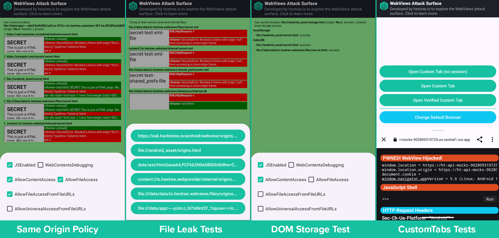

# WebView Research

This app runs various tests to explore the attack surfae and exploit strategies around Android [WebView](https://developer.android.com/develop/ui/views/layout/webapps/webview) and [CustomTabs](https://developer.chrome.com/docs/android/custom-tabs/guide-get-started). We developed this app as part of the [Hextree Android app security courses](https://app.hextree.io/map/android/android-webview) ([sponsored by Google](https://www.hextree.io/hextree-x-google)).



**Signed Builds:**
- Debug Build: [io.hextree.webview_debug.apk](app/debug/io.hextree.webview_debug.apk)
- Release Build: [io.hextree.webview.apk](app/release/io.hextree.webview.apk)

**Table of contents:**

- [1. Test Cases](#1-test-cases)
- [2. WebView Settings and Origins](#2-webview-settings-and-origins)
- [3. Results](#3-test-results)
    - [3.1 FileProvider SOP](#31-fileprovider-sop)
    - [3.2 Extract NativeLibs Trick](#32-extract-nativelibs-trick)

## 1. Test Cases
The app can load different test cases in the WebView. Each test consists of a single .html file with Javascript to test access on different origins.

- [Same Origin Policy Test](app/src/main/assets/origins.html)
- [Internal File Leak Tests](app/src/main/assets/files.html)
- [DOM Storage Tests](app/src/main/assets/storage.html)
- [JavaScript Interface Tests](app/src/main/assets/pwn.html)

Additionally the app also explores features of [CustomTabs](https://developer.chrome.com/docs/android/custom-tabs/guide-get-started):

- CustomTab without session
- CustomTab with session
- CustomTab with verified origin

## 2. WebView Settings and Origins

Depending on the [WebView settings](https://developer.android.com/reference/android/webkit/WebSettings) and the origin of the loaded .html file, the test case results differ. Thus we can change the settings on the fly and observe how they affect the tests:

- [`setJavaScriptEnabled(boolean)`](https://developer.android.com/reference/android/webkit/WebSettings#setJavaScriptEnabled(boolean))
- [`setAllowContentAccess(boolean)`](https://developer.android.com/reference/android/webkit/WebSettings#setAllowContentAccess(boolean))
- [`setAllowFileAccess(boolean)`](https://developer.android.com/reference/android/webkit/WebSettings#setAllowFileAccess(boolean))
- [`setAllowFileAccessFromFileURLs(boolean)`](https://developer.android.com/reference/android/webkit/WebSettings#setAllowFileAccessFromFileURLs(boolean))
- [`setAllowUniversalAccessFromFileURLs(boolean)`](https://developer.android.com/reference/android/webkit/WebSettings#setAllowUniversalAccessFromFileURLs(boolean))

We can also load the test case from different sources (origins):

- Website: `https://oak.hextree.io/android/webview/<testcase>.html`
- APK assets: `file:///android_asset/<testcase>.html`
- data URI: `data:text/html;base64,PGgxPmhleHRyZWUuaW88L2gxPgpMZWFybiBoYWNraW5nIG9uIEhleHRyZWU=`
- FileProvider: `content://io.hextree.webprovider/internal/<testcase>.html` 
- Absolute path `file:///data/data/io.hextree.webviews/files/<testcase>.html`
- Native libs trick: `file:///data/app/~~pUnr.../lib/arm64/<testcase>.html`

## 3. Test Results

Let's go over a few interesting results

### 3.1 FileProvider SOP

[By default](https://developer.android.com/reference/android/webkit/WebSettings#setAllowContentAccess(boolean)) WebViews can load resources from `content://` URIs. This means an app can easily expose a malicious .html file via a [FileProvider](https://developer.android.com/reference/androidx/core/content/FileProvider).

1. If [`setAllowFileAccessFromFileURLs(true)`](https://developer.android.com/reference/android/webkit/WebSettings#setAllowFileAccessFromFileURLs(boolean)) is set, then JavaScript can leak data from any other accessible FileProvider. Depending on the configured file paths (see example below), this could be used to leak app internal files.
```xml
// Example AndroidManifest.xml
<provider
    android:name="androidx.core.content.FileProvider"
    android:authorities="io.hextree.webview"
    android:exported="false" android:grantUriPermissions="true">
    <meta-data
        android:name="android.support.FILE_PROVIDER_PATHS"
        android:resource="@xml/filepaths" />
</provider>

// FileProvider config: xml/filepaths.xml
<paths>
    <files-path name="internal" path="." />
</paths>
```
2. If [`setAllowUniversalAccessFromFileURLs(true)`](https://developer.android.com/reference/android/webkit/WebSettings#setAllowUniversalAccessFromFileURLs(boolean)) is set, then the `content://` origin is partially treated as a file URL. While XHR requests are not allowed, file leaks via `<iframe>` is possible.


### 3.2 Extract NativeLibs Trick

Due to [scoped storage](https://developer.android.com/about/versions/11/privacy/storage#other-app-specific-dirs) introduced in Android 11 it basically became impossible to create a `file://` that can be read by other apps:

> On Android 11, apps can no longer access files in any other app's dedicated, app-specific directory within external storage."*

Because as an attacker we would like to load a malicous page served from the `file://` origin, this makes it difficult to attack WebViews without additional permissions like [`MANAGE_EXTERNAL_STORAGE `](https://developer.android.com/reference/android/Manifest.permission#MANAGE_EXTERNAL_STORAGE). However we found a trick to write a malicious .html file into a publicly accessible folder abusing the [`extractNativeLibs`](https://developer.android.com/guide/topics/manifest/application-element#extractNativeLibs) feature.


1. Set the [`extractNativeLibs`](https://developer.android.com/guide/topics/manifest/application-element#extractNativeLibs) attribute in the Android manifest to true.
```xml
<?xml version="1.0" encoding="utf-8"?>
<manifest xmlns:android="http://schemas.android.com/apk/res/android" xmlns:tools="http://schemas.android.com/tools">
    <application
        android:extractNativeLibs="true"
        ...
```
2. Create the `resources/lib` folder in your Android app project. Then create folders for each possible architecture (`arm64`, `arm64-v8a`, `armeabi`, `armeabi-v7a`,`mips`, `mips64`, `riscv64`, `x86`, `x86_64`) and copy a malicious .html into them.
3. Build the app as an APK in debug mode: `Build > Generate Signed App Bundle / APK > APK > ... > debug`
4. Upon installation the malicious .html will be written into the `getApplicationInfo().nativeLibraryDir` directory and can be loaded into any WebView with [`setAllowFileAccess(true)`](https://developer.android.com/reference/android/webkit/WebSettings#setAllowFileAccess(boolean))


